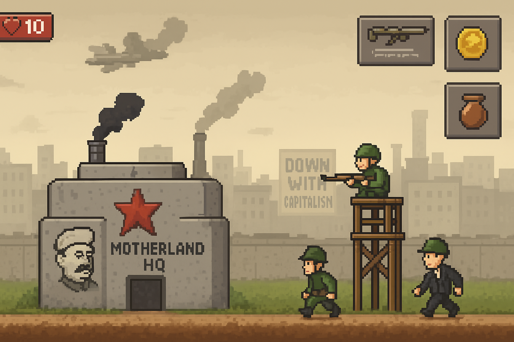
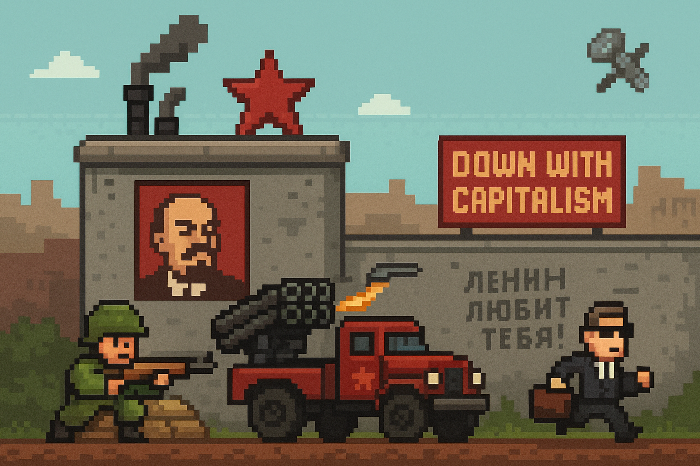

# 🚩 Soviet Tower Defense

A Soviet-themed tower defense game built with Godot 4.5, where you defend the glorious motherland against waves of capitalist invaders!




## 🎮 Game Features

### Tower Types
- **Guard Tower** - Basic projectile tower with reliable damage
- **Propaganda Speaker** - Slows enemies with ideological broadcasts
- **Bureaucratic Office** - Deals continuous area damage to all nearby enemies
- **Missile Station** - Heavy damage, long range, slow fire rate

### Enemies
- **Businessman** - Basic capitalist unit
- **Tourist** - Fast but weak
- **Oligarch** - Wealthy and resilient
- **CEO Boss** - Powerful boss enemy (500 HP!)

### Game Mechanics
- **6 Progressive Waves** - Increasing difficulty with mixed enemy types
- **Economy System** - Earn rubles by eliminating enemies, spend to build towers
- **Lives System** - Start with 20 lives, lose one per enemy that reaches the end
- **Manual Wave Start** - Strategic control over when to face the next challenge
- **Tower Placement Validation** - Smart placement system prevents overlaps

## 🛠️ Technical Details

### Built With
- **Godot Engine**: 4.5
- **Language**: GDScript
- **Target Platform**: Android (optimized for mobile)
- **Rendering**: Mobile renderer with pixel-perfect settings

### Project Structure
```
scenes/
├── main/          # Main game scene, menu
├── towers/        # 4 tower type scenes
├── enemies/       # 4 enemy type scenes
├── projectiles/   # Bullet/missile projectiles
└── ui/            # Game UI and HUD

scripts/
├── autoloads/     # Global managers (GameManager, EventBus, etc.)
├── managers/      # Game systems (WaveManager, EconomyManager, etc.)
├── towers/        # Tower behavior scripts
├── enemies/       # Enemy AI and pathfinding
└── projectiles/   # Projectile movement and collision

addons/
├── phantom_camera/    # Camera management
└── dialogic/          # Dialogue system (for future story mode)
```

### Architecture Highlights
- **Singleton Pattern** - Global managers via Godot's autoload system
- **EventBus Pattern** - Decoupled communication between systems
- **Scene Inheritance** - BaseTower/BaseEnemy classes for shared functionality
- **Signal-Based Design** - Event-driven tower targeting and wave management

## 🚀 Getting Started

### Prerequisites
- Godot 4.5 or later
- Android device/emulator (optional, for mobile testing)

### Running the Game
1. Clone the repository
2. Open the project in Godot Engine 4.5+
3. Press **F5** to run the game
4. Click tower buttons to select, click on map to place
5. Click **START WAVE** to begin

### Controls
- **Mouse Click** - Select towers, place towers, start waves
- **UI Buttons** - Tower selection, wave start, game speed control

## 🎯 How to Play

1. **Build Towers**: Click a tower button (costs rubles), then click a valid location on the map
2. **Start Wave**: Click the START WAVE button when ready
3. **Defend**: Towers automatically target and shoot enemies
4. **Earn Money**: Gain rubles for each enemy eliminated
5. **Survive**: Don't let too many enemies reach the end (you have 20 lives)
6. **Progress**: Complete all 6 waves to achieve victory!

### Strategy Tips
- **Propaganda Speakers** slow enemies, giving other towers more time
- **Bureaucratic Offices** excel against grouped enemies
- **Missile Stations** are expensive but essential for high-HP bosses
- **Guard Towers** provide cost-effective coverage for early waves

## 📊 Game Balance

### Tower Stats
| Tower | Cost | Damage | Range | Special |
|-------|------|--------|-------|---------|
| Guard Tower | 100₽ | 25 | 200 | Reliable DPS |
| Propaganda Speaker | 150₽ | 0 | 180 | 50% slow for 3s |
| Bureaucratic Office | 200₽ | 15/tick | 150 | Hits all in range |
| Missile Station | 300₽ | 100 | 250 | Long range, slow |

### Wave Progression
1. **Wave 1**: 5 Businessmen (tutorial wave)
2. **Wave 2**: 8 Businessmen (faster spawns)
3. **Wave 3**: 5 Businessmen + 3 Tourists (mixed)
4. **Wave 4**: 10 Tourists (speed test)
5. **Wave 5**: 6 Businessmen + 6 Tourists (12 enemies!)
6. **Wave 6**: 1 CEO Boss (500 HP challenge)

## 🎨 Asset Status

Currently using **placeholder graphics**:
- Towers: Colored rectangles (gray, green, red, brown, orange-red)
- Enemies: Blue rectangles
- Projectiles: Yellow/red dots
- UI: Functional buttons with text labels

*Visual assets are planned for future development*

## 🔧 Development

### Current Status
✅ Core tower defense mechanics
✅ All 4 tower types functional
✅ 6-wave progression system
✅ Economy and lives systems
✅ Tower placement validation
✅ Enemy pathfinding
✅ Collision detection
✅ Wave completion detection

### Planned Features
- [ ] Visual assets (sprites, animations)
- [ ] Audio (music, sound effects, voice lines)
- [ ] Tower upgrade system
- [ ] Multiple levels
- [ ] Save/load system
- [ ] Settings menu
- [ ] Mobile touch controls
- [ ] Particle effects
- [ ] Victory/defeat screens
- [ ] Localization (Russian translation)

## 📝 License

This project is open source and available for educational purposes.

## 🤝 Contributing

This is a personal learning project, but feedback and suggestions are welcome!

---

*Defend the motherland, comrade! 🚩*
